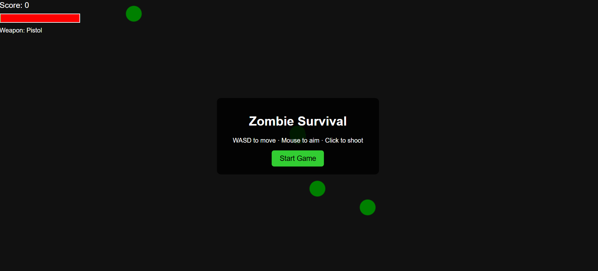

# Project Title: Top-Down Zombie Survival

## Student Details
- **Name**: Rajdeep Chakraborty 
- **PRN**: 25070127073  
- **Year**: FY  
- **Branch**: Robotics and Automation

---

## Problem Statement
"We often forget our childhood memories. This game brings us back our old memories from it and makes us happy"

---

## Features
 - Bring back old Memories 
 - Helps us to refresh our mind 
 - Enjoy your leisure time 

---

## Tech Stack
- HTML, CSS, JavaScript

---

## How to Run
1. Right click on the index1.html file.
2. Connect with the live server.
3. Play the game.

---

## Project Structure

your-project/ ├── README.md ├── src/        index1.html ├── docs/       # (optional) documentation └── sample_output/   # (optional) if you use APIs

---

## Demo Screenshot / Output

---

## AI Tools Used
1. Copilot 
2. Chatgpt

---

## Future Improvements
1. I would include much more specific Character structure.
2. I would like to make real guns in the main chracters hand.
3. I would also make the game environment more lively and more intense with a graphics.
---

## Notes for Reviewers
The project runs offline in the live server.

---

## Submission Checklist 
- [✅ ] Cloned the Repository 
- [✅ ] Added my details (Name, PRN, Year, Branch)  
- [✅ ] Wrote Problem Statement  
- [✅ ] Listed Features & Tech Stack  
- [✅ ] Added clear Run Instructions  
- [✅ ] Provided Demo Output (screenshot or text)  
- [✅ ] Listed AI tools used (or None)  
- [✅ ] Explained Future Improvements  
- [✅ ] Project runs offline

