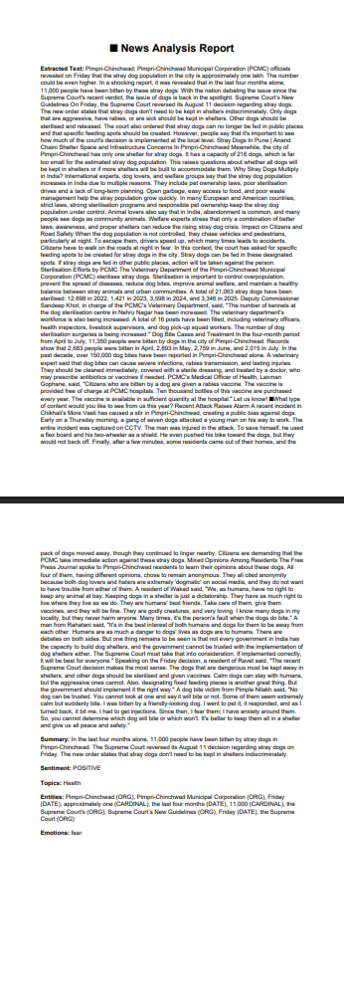

# Project Title: An NLP-Based Web Application for Automatic News Summarization

## Student Details
- **Name**: Shreyans Samrat Gadekar  
- **PRN**: 23070126043  
- **Year**: TY  
- **Branch**: AIML  

---

## Problem Statement
News articles are frequently lengthy and slanted, making it difficult for readers to quickly understand the point.  
This project combines news article summaries, subject classification, sentiment detection, wordcloud generation, entity extraction, and report generation into a single app.

---

## Features
List the main things your project can do.  
Example:  
- Extracts article text from any given news URL  
- Summarizes news content using Hugging Face transformers  
- Performs **sentiment analysis** (Positive/Negative)  
- Classifies articles into topics (Politics, Sports, Technology, etc.)  
- Extracts **Named Entities** (people, organizations, locations, etc.)  
- Detects **emotions** (Fear, Anger, Joy, Sadness, etc.)  
- Generates a **word cloud visualization**  
- Creates downloadable **PDF reports** for journalists/researchers  
- Futuristic **Streamlit UI with background image**

---

## Tech Stack
- **Python**  
- **Streamlit** (UI)  
- **Hugging Face Transformers** (NLP models)  
- **Newspaper3k / BeautifulSoup** (text extraction)  
- **spaCy** (Named Entity Recognition)  
- **WordCloud + Matplotlib** (visualization)  
- **ReportLab** (PDF generation)

---

## How to Run
Explain step by step how to run your project.  
Example:  
1. Clone the repository
2. Install dependencies
    pip install -r requirements.txt
    Download SpaCy English model
    python -m spacy download en_core_web_sm
3. Run the Streamlit app
    streamlit run app.py

---

## Project Structure

GADEKAR_SHREYANS/ 
├── README.md 
├── requirements.txt 
├── background image 
└── sample_output/report and screenshots of web app 

---

## Demo Screenshot / Output

---

## AI Tools Used
- ChatGPT (for guidance & debugging)
- Hugging Face Transformers (for NLP models)

---

## Future Improvements
- Add multi-language support (Hindi, Marathi, etc.)
- Integrate a real-time news feed scraper
- Improve summarization quality with fine-tuned models

---

## Notes for Reviewers
- URL link to the deployed web app:- https://news-summarizer-withwordcloudandreportpdf.streamlit.app/ 
- Requires an internet connection for Hugging Face models & article extraction.
- Background image path must be updated if running on a different system.

---

## Submission Checklist 
- [x] Cloned the Repository 
- [x] Added my details (Name, PRN, Year, Branch)  
- [x] Wrote Problem Statement  
- [x] Listed Features & Tech Stack  
- [x] Added clear Run Instructions  
- [x] Provided Demo Output (screenshot or text)  
- [x] Listed AI tools used (or None)  
- [x] Explained Future Improvements  
- [x] Project runs offline