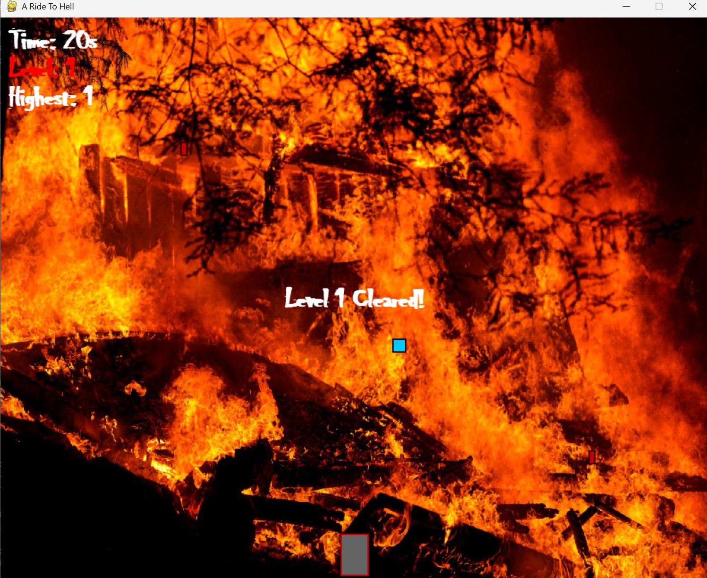

# Project Title: A Ride To Hell

## Student Details
- **Name**: Adwaiy Gupta
- **PRN**: 25070126018
- **Year**: First Year 
- **Branch**: AIML

---

## Problem Statement
Just wanted to check if I remembered how to make a basic game in python. It's just a simple escape the projectiles, as you try to make your way out of hell. The difficulty rampus up the further away you get.
---

## Features
- Can show the highest level the player has reached
- Power-Ups are present
- The background moves with the playable character, giving it a realistic feeling
---

## Tech Stack
Python, and pygame module downloaded seperately.(Decent at python, had to use AI for a lot of parts I had no idea about.)

---

## How to Run  
1. Open the folder in VS Code.  
2. Run `pythonmainfinal5.py`  
3. Make sure to have pygame module installed.

---

## Project Structure

A-Ride-To-Hell/
├── README.md
├── src/                  # your code
│   ├── pythonmainfinal.py     # version one
│   ├── pythonmainfinalv2.py   # version two 
│   ├── pythonmainfinal3.py    # version three
│   └── pythonmainfinal4.py    # version four
    └── pythonmainfinal5.py    # final version

---

## Demo Screenshot / Output
Add a screenshot of your project running, or copy-paste sample terminal output here.

Hello from the pygame community. https://www.pygame.org/contribute.html
PS C:\Users\Adwaiy\FOSS-Recruitment-2025> & C:\Users\Adwaiy\AppData\Local\Programs\Python\Python312\python.exe c:/Users/Adwaiy/FOSS-Recruitment-2025/projects/Gupta_Adwaiy/pythonmainfinal5.py
pygame 2.6.1 (SDL 2.28.4, Python 3.12.8)
---

## AI Tools Used
ChatGPT

---

## Future Improvements
I would like to add custom sprites, along with custom worlds and more backgrounds. Would love to add something like a boss battle too of some sort. Cleaning up the code and making it run smoother could also be in the works.

---

## Notes for Reviewers
Please download pygame module and the image hell.jpg that I attached.

## Submission Checklist 
- [x] Cloned the Repository 
- [x] Added my details (Name, PRN, Year, Branch)  
- [x] Wrote Problem Statement  
- [x] Listed Features & Tech Stack  
- [x] Added clear Run Instructions  
- [x] Provided Demo Output (screenshot or text)  
- [x] Listed AI tools used (or None)  
- [x] Explained Future Improvements  
- [x] Project runs offline

