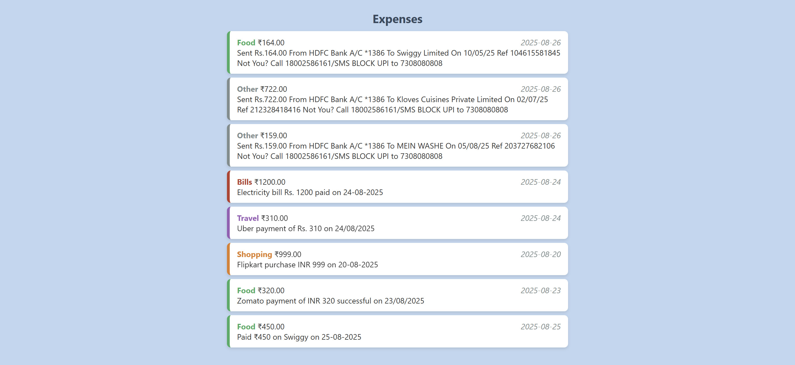

# Project Title: SMS Expense Tracker

## Student Details
- **Name**: Vinamra Jain  
- **PRN**: 24070122232  
- **Year**: SY  
- **Branch**: CSE  

---

## Problem Statement
Users receive multiple transaction SMS daily and often forget or lose track of their expenses. This project helps users automatically log expenses from SMS, categorize them, and view totals easily in a browser.
---

## Features
- Paste SMS and automatically detect amount, category, and date
- Categories: Food, Shopping, Travel, Bills, Other
- Displays expense list with category-colored highlights
- Shows category-wise totals in a table
- Most recent transactions appear at the top of the list
- Copy all expenses to clipboard
- Clear all expenses
- Works completely offline

---

## Tech Stack
- HTML
- CSS
- JavaScript

---

## How to Run

1. Download or clone the project folder.
2. Open index.html in any modern browser (Chrome/Edge/Firefox).
3. Paste your transaction SMS in the text area.
4. Click Add Expense to log it.
5. View expenses in the list and category totals in the table.
6. Use Copy All to copy all logged expenses or Clear All to reset.

---

## Project Structure

projects/Jain_Vinamra/
├── index.html        # Main HTML page
├── style.css         # Styling for the app
├── script.js         # Main JavaScript logic
├── README.md         # This file
└── sample_sms.txt    # Sample SMS for testing

---

## Demo Screenshot / Output
Add a screenshot of your project running, or copy-paste sample terminal output here.

---

## AI Tools Used
- Used ChatGPT for guidance on JavaScript logic and UI suggestions.
---

## Future Improvements

- Add automatic SMS reading from phone (requires permissions).
- Add AI-based categorization for unknown merchants.
- Add graphs or charts for monthly spending
- Export data to CSV or PDF.
- Mobile-friendly responsive design.
---

## Notes for Reviewers
- Fully offline and works in any modern browser.
- Sample SMS can be tested using sample_sms.txt.
- All expenses are stored in browser localStorage for persistence.

---

## Submission Checklist 
- [✔] Cloned the Repository 
- [✔] Added my details (Name, PRN, Year, Branch)  
- [✔] Wrote Problem Statement  
- [✔] Listed Features & Tech Stack  
- [✔] Added clear Run Instructions  
- [✔] Provided Demo Output (screenshot or text)  
- [✔] Listed AI tools used (or None)  
- [✔] Explained Future Improvements  
- [✔] Project runs offline

