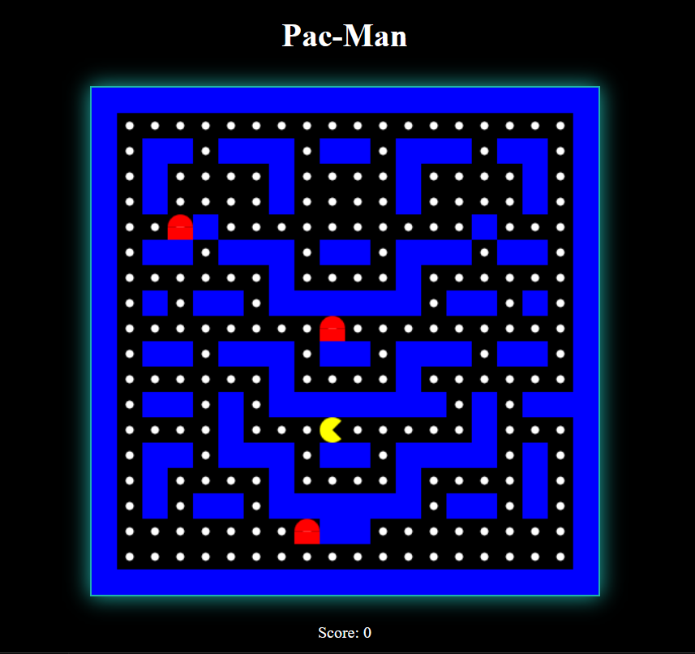

# Project Title: Browser Pac-Man

## Student Details
- **Name**: Ebrahim Jamali  
- **PRN**: 24070127042
- **Year**: SY
- **Branch**: Robotics and Automation 

---

## Problem Statement
It's just Pac-Man, but it is built entirely on HTML, CSS and JavaScript!!! This empowers an extremely light and performance friendly game executable in any browser. Accessible, Easy to run and lightweight, ready to be launched in a web domain. Enjoy Pac-Man once again!
---

## Features
- Playable Pac-Man game in browser
- Grid-based maze with walls and pellets
- Moving enemies that chase Pac-Man
- Score counter displayed dynamically
- Game Over and You Win screens
- Restart game functionality  
 

---

## Tech Stack
- HTML5
- CSS3
- JavaScript (ES6)

---

## How to Run
Explain step by step how to run your project.  
Example:  
1. Download and open the folder "pacman"  
2. Run by double-clicking on main.html  
3. Control by using arrow keys

---

## Project Structure
Jamali_Ebrahim/  
├── README.md  
├── GameScreenshot.png  
└── pacman/  
    ├── main.html  
    ├── mainScript.js  
    ├── gameover.css  
    ├── gamestyle.css  
    └── gamewin.css  

---

## Demo Screenshot / Output

---

## AI Tools Used
ChatGPT (for guidance on game logic and code structuring)

---

## Future Improvements
- Add smooth Pac-Man animations and enemy animations
- Add better styling for game over and win pages
- Write a random level generating algorithm
- Add power ups for pacman
- Add proper pathfinding to enemies

---

## Notes for Reviewers
- The project runs entirely offline and only requires a modern browser.
- No additional software or installation is needed—just open main.html.
- The enemies stopping is game-design not a bug, they try to find shortest route and will follow pacman again once unblocked

---

## Submission Checklist 
- [x] Cloned the Repository 
- [x] Added my details (Name, PRN, Year, Branch)  
- [x] Wrote Problem Statement  
- [x] Listed Features & Tech Stack  
- [x] Added clear Run Instructions  
- [X] Provided Demo Output (screenshot or text)  
- [x] Listed AI tools used (or None)  
- [x] Explained Future Improvements  
- [x] Project runs offline

