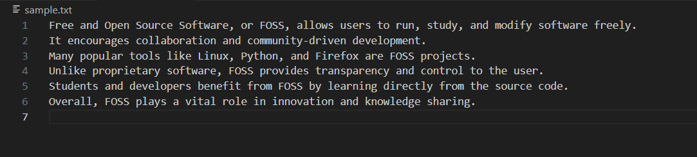
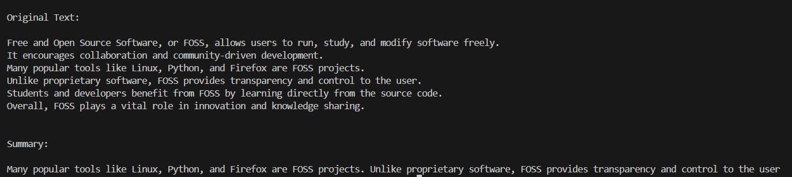

# Project Title: Text Summarizer

## Student Details
- **Name**: Kavish Nag
- **PRN**: 24070126085
- **Year**: SY  
- **Branch**: AIML  

---

## Problem Statement
Long text documents are often difficult to read quickly. This project provides a simple offline tool that summarizes .txt files by identifying frequent keywords and selecting important sentences.

---

## Features
1. Summarizes text documents without internet or APIs.
2. Identifies top keywords based on frequency.
3. Extracts important sentences from the input file.
4. Works fully offline using pure Python.
5. Simple, and easy to use.

---

## Tech Stack
Languages - Python
Libraries Used: os, string (built-in libraries)

---

## How to Run
1. Open the folder in VS Code.  
2. Run the code file (main.py)
3. The program will start in offline mode.
4. Place your .txt file in the project folder
5. Run the program
6. Output will display the summary of the text file.

---

## Project Structure

offline-text-summarizer/
|-README.md
|- main.py   
|- sample.txt       

---

## Demo Screenshot / Output

---

## AI Tools Used
Chat GPT
- To get words which doesn't mean much meaning.
- Help with fixes in summarize function
- To create the sample text file
- Cleaning of code.
---

## Future Improvements
- Add option to summarize PDFs
- Create a simple GUI version, for friendly user interface.

---

## Notes for Reviewers
Runs fully offline by default.
No internet or API dependency.

---

## Submission Checklist 
- [x] Cloned the Repository 
- [x] Added my details (Name, PRN, Year, Branch)  
- [x] Wrote Problem Statement  
- [x] Listed Features & Tech Stack  
- [x] Added clear Run Instructions  
- [x] Provided Demo Output (screenshot or text)  
- [x] Listed AI tools used (or None)  
- [x] Explained Future Improvements  
- [x] Project runs offline

