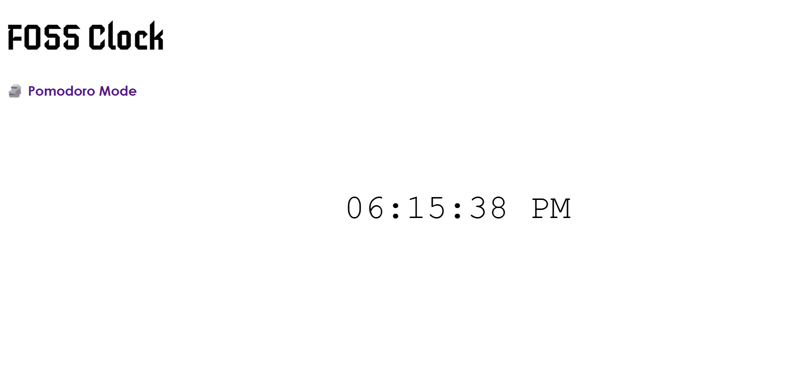
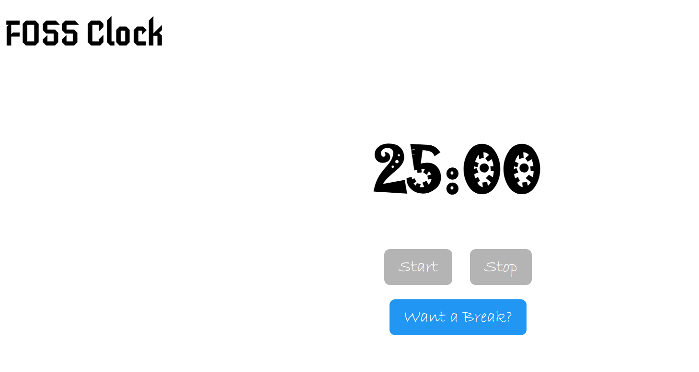

# Project Title: Basic Clock with Pomodoro Mode Timer Feature

## Student Details
- **Name**: Ayush Pathare  
- **PRN**: 25070125016  
- **Year**: FY   
- **Branch**: Mechanical   

---

## Problem Statement
To track time right in a browser tab during split window mode while completing assignments, with included pomodoro mode feature as a method to encourage students by preventing procrastination and avoiding sitting for longer periods of time to allow walking every 25 minutes.

---

## Features  
- Live Time (12 Hour Format)
- Pomodoro Mode : With Start/Stop Mode

---

## Tech Stack
- HTML 5, CSS 3, JavaScript
- AI Code Generation : ChatGPT (For Java Script Only)
- AI Troubleshooting Assistant for Debugging : Copilot
- Google and Microsoft Fonts Library

---

## How to Run 
1. Open the folder in VS Code.  
2. Right Click `index.html` and choose 'Reveal in File Explorer'  
3. Right Click the `index.html` file and open in your default browser.

---

## Output

---

## AI Tools Used
ChatGPT , CoPilot

---

## Future Improvements
Write how you would improve this project if you had more time.  

I initially wanted to add a sound effect alarm once the timer gets to zero and the screen to give a fade-in fade-out red color flash effect, however after several attempts I had to discard the feature since it was breaking other parts of code which I wasn't able to fix with my current skillbase.

But I'm pretty sure it is a very doable feature and can be added with more time at hand. I need to improvise further on my skill set of the domain to add the programmming for it.

---

## Notes for Reviewers
Just need to clone the files locally and run the `index.html` file in a brwoser.

Also, I realised I missed adding a feature to go back to 25-Mins timer from 5 Min timer, but another trick to do that is press F5.
 (Yeah, it should definitely be working that way)
---

## Submission Checklist 
- [x] Cloned the Repository 
- [x] Added my details (Name, PRN, Year, Branch)  
- [x] Wrote Problem Statement  
- [x] Listed Features & Tech Stack  
- [x] Added clear Run Instructions  
- [x] Provided Demo Output (screenshot or text)  
- [x] Listed AI tools used (or None)  
- [x] Explained Future Improvements  
- [x] Project runs offline
