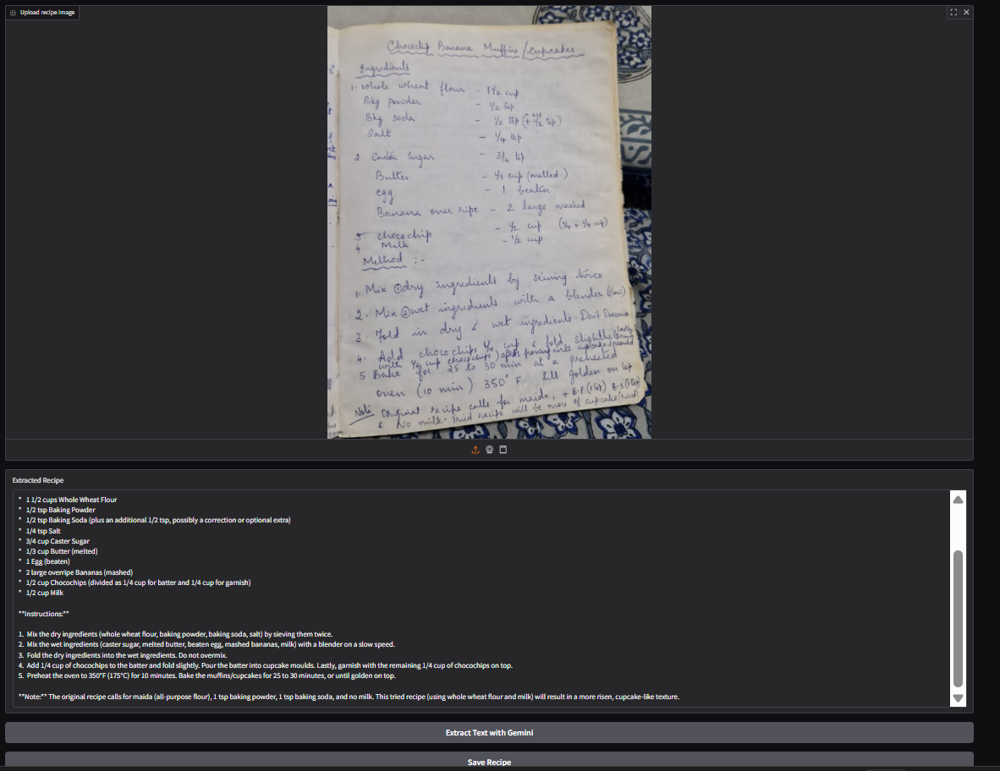
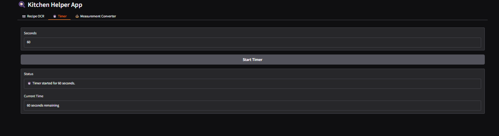
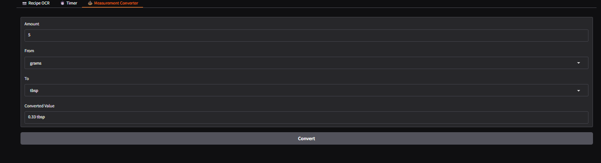

# Project Title: CookLens: Modern Tool to Preserve and Simplify Cooking 

## Student Details
- **Name**: Eshaan Sumesh 
- **PRN**: 24070126058 
- **Year**: Second year
- **Branch**: AiMl
---

## Problem Statement
Home cooks often struggle with preserving handwritten or online recipes, converting between different kitchen units, and managing cooking time. This project offers a kitchen convenience tool that extracts and saves recipes locally, provides quick unit conversions, and includes a built in timer making cooking easier and more organized.

---

## Features
Extract recipes from handwritten/printed images using Gemini OCR

Save extracted recipes locally

Set and track kitchen timers with live updates

Convert between cooking units (grams, cups, ml, tbsp, tsp)

Simple, user-friendly Gradio web interface

---

## Tech Stack
Python
Gradio (UI framework)
Google Gemini API (OCR)
Chat gpt (For help with ui and code debuging)
---

## How to Run
1) Install requirements using:

    pip install gradio google-genai

2) Open the file cooklens.py and make sure your Gemini API key is pasted in the code.

3) Run the program with:

    python cooklens.py

4) Click the link shown in the terminal to use the app.

---

## Project Structure

Kitchen-Helper-App/  
├── cooklens.py         # Main application code (OCR, Timer, Converter, Gradio UI)  
├── recipes/            # Folder where extracted recipes are saved  
├── README.md           # Documentation file  
├── requirements.txt    # Includes google genai 

---

## Demo ScreenShot

---

## AI Tools Used
Ai tools Used-
1) Chat gpt for ui
2) Gemini for code dubugging

---

## Future Improvements
Some changes i would like to make are:
1) Integrate a voice assistant with this project
2) to add an assistant that would answer questions you have based on the uploaded recipe
3) Add a recipe scaler 
4) Add a better ui.

## Submission Checklist 
- [x] Cloned the Repository
- [x] Added my details (Name, PRN, Year, Branch)
- [x] Wrote Problem Statement
- [x] Listed Features & Tech Stack
- [x] Added clear Run Instructions
- [x] Provided Demo Output (screenshot or text)
- [x] Listed AI tools used (or None)
- [x] Explained Future Improvements
- [ ] Project runs offline

