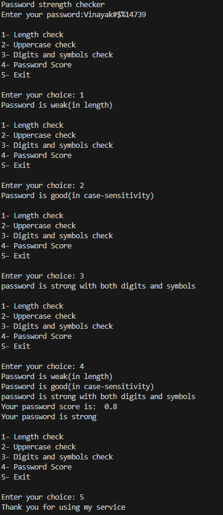

# Project Title: Write your project name here

## Student Details
- **Name**: Vinayak Varshney  
- **PRN**: 24070126204
- **Year**: SY  
- **Branch**: AIML  

---

## Problem Statement

This project helps users quickly evaluate whether their passwords are weak or strong by checking for length, numbers, and symbols.

---

## Features
Nothing much for now but will be there soon and before 11:59 on tuesday 26 Aug 2025
- v0.01
    - you can now input a password... yay!!!
- v0.03
    - you can now check if your password is strong or weak... yay 2 !!!
- v0.05
    - you can now check for if the password has an uppercase character
- v0.07
    - you can now check for if the password has a digit and special character
- v0.1
    - you password now has a score (heheheeheheh)
- Works offline 

---

## Tech Stack

Python is used.

---

## How to Run

1. Open the folder in VS Code.  
2. Run `python main.py`  
3. The program will start in offline mode(CLI).

---

## Project Structure

├── projects/
│   └── Varshney_vinayak/
│       ├── main.py
│       └── Readme.md

---

## Demo Screenshot / Output

---

## AI Tools Used

None

---

## Future Improvements

Not sure decided this on a whim but proly i would add a GUI (meh).
This may be a EOL commit(v0.1) lol.

---

## Notes for Reviewers

Any extra note for the FOSS team.  
"This project runs locally."

---

## Submission Checklist 
- [x] Cloned the Repository 
- [x] Added my details (Name, PRN, Year, Branch)  
- [x] Wrote Problem Statement  
- [x] Listed Features & Tech Stack  
- [x] Added clear Run Instructions  
- [x] Provided Demo Output (screenshot or text)  
- [x] Listed AI tools used (or None)  
- [x] Explained Future Improvements  
- [x] Project runs offline

